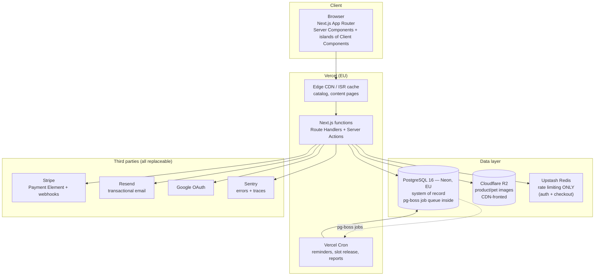
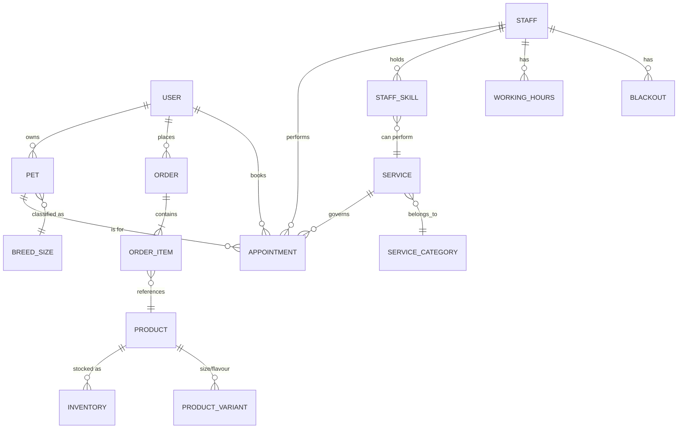

# System Architecture — Paws & Claws Pet Shop + Grooming

| | |
|---|---|
| **Status** | Draft v2.0 — replaces generic template v1.0 |
| **Owner** | Project lead (solo/small team) |
| **Last updated** | 2026-10-06 |
| **Review trigger** | Any ADR change, >2× traffic growth, or new payment/PII surface |

---

## 1. Summary

A single website that does two jobs for a pet shop:

1. **Retail** — product catalog (food, toys, accessories), cart, card checkout, delivery or in-store pickup, order history.
2. **Grooming** — bookable appointments with groomers, per-pet profiles (breed, size, coat, temperament, vaccination records), slot selection, deposits for peak slots, reminders.

It is a **modular monolith**: one Next.js application, one Postgres database, one deploy target. No microservices, no message broker, no Kubernetes. The system earns complexity only when measurements demand it (see §14).

### 1.1 Assumptions (unconfirmed — correct these and the doc changes)

The intake form was submitted with only the product description filled in. Everything below is an **assumption, not a fact**:

| # | Assumption | If wrong |
|---|---|---|
| A1 | Single shop location, single country, single currency | Multi-location adds `location_id` to staff/products/appointments and inventory partitioning |
| A2 | ~50k monthly visits, ~200 concurrent users at peak, ~30 avg / 100 peak QPS | >500 QPS triggers the caching + read-replica work in §14 |
| A3 | ~1,200 products, ~40k orders/yr, ~250 appointments/week | Nothing here changes; these are tiny numbers for Postgres |
| A4 | Team = 1–3 developers | More teams → split deploy pipelines, add staging gatekeepers |
| A5 | GDPR-equivalent privacy duty (EU/UK hosting); no PCI card handling (Stripe hosted fields → SAQ-A) | US-only would relax data-residency, not the security model |
| A6 | Accessible to **WCAG 2.2 AA** (booking flow is the critical path) | — |
| A7 | Marketing + transactional site, not a marketplace (no third-party sellers) | Marketplace → seller onboarding, payouts, way more scope |

---

## 2. Quality attributes (measurable targets)

These are the numbers the architecture is designed against. Anything not listed here is not a requirement.

| ID | Attribute | Target | How it's verified |
|---|---|---|---|
| Q1 | Availability (browse, book, checkout) | 99.9% monthly (~43 min downtime) | Uptime probe every 60s on `/healthz` + synthetic booking |
| Q2 | Latency — cached page TTFB | p95 < 200 ms | CDN analytics |
| Q3 | Latency — API (p95) | p95 < 400 ms, p99 < 1 s | APM traces |
| Q4 | Core Web Vitals | LCP ≤ 2.5 s, CLS < 0.1, INP ≤ 200 ms at p75 | Lighthouse CI budget in PRs |
| Q5 | Booking correctness | **Zero** double-bookings, ever | DB exclusion constraint (§7.3) — correctness enforced in the database, not application code |
| Q6 | Inventory correctness | No oversell | Conditional update in one transaction (§9.2) |
| Q7 | Checkout conversion | ≥ 97% of started checkouts reach payment success (excl. card declines) | Stripe dashboard + funnel events |
| Q8 | Accessibility | WCAG 2.2 AA; booking completable with keyboard only and a screen reader | axe in CI + manual pass per release |
| Q9 | Data durability / recovery | RPO ≤ 5 min, RTO ≤ 60 min | PITR + monthly restore drill |
| Q10 | Security | No P1/P2 vulnerabilities open > 7 days; dependency CVEs triaged weekly | Dependabot + Sentry |
| Q11 | Change safety | Every merge to `main` deployable; rollback < 5 min | Preview deploys + instant rollback |

---

## 3. System overview



**Trust boundaries:** the browser is untrusted; everything crossing it is validated with Zod at the edge of the handler. The only inbound public endpoint is the Stripe webhook (signature-verified). The database is private (no public IP), reachable only by the functions.

### 3.1 Request paths

| Path | Cache | Notes |
|---|---|---|
| Product/content pages | ISR, 5-min revalidate, stale-while-revalidate | Fast + SEO-friendly; cart/price always rendered dynamic |
| Catalog browse/search | CDN + `stale-while-revalidate` | Search is Postgres full-text + trigram, no search service at this scale |
| Cart / account / booking | Never cached | Per-user, `Cache-Control: private, no-store` |
| Webhooks | Never cached | Idempotent (§9.3) |

---

## 4. Components

### 4.1 Frontend — Next.js 15 (App Router, TypeScript)

- **Responsibilities:** rendering, routing, forms via Server Actions, SEO (JSON-LD for `Product`, `LocalBusiness`, `Event`), client-side interactivity only where it earns it (slot picker, cart drawer, image gallery).
- **Rendering rules:** Server Components by default; Client Components only for stateful widgets. No client-side data fetching for first paint.
- **Styling:** Tailwind CSS + design tokens as CSS custom properties (color, type scale, spacing) — no raw hex in components. Per the design skill in this repo, motion is limited to one orchestrated moment; `prefers-reduced-motion` respected.
- **Not used at launch:** Redux/global state library (server state is the server's job), Redis page cache, GraphQL.

### 4.2 Application layer — same Next.js app (modular monolith)

One deployable, organized as internal modules so boundaries are real, not decorative:

```text
src/
  modules/
    catalog/      products, categories, search
    cart/         cart, line items, promotions
    checkout/     order creation, payment intent, webhook handling
    booking/      services, slots, appointments, deposits
    pets/         pet profiles, vaccination records
    identity/     auth, sessions, roles, password reset
    admin/        staff UI: orders, schedule, inventory
  core/
    db/           Drizzle schema, migrations, transaction helper
    validation/   Zod schemas shared by actions, handlers, forms
    jobs/         pg-boss producers/consumers
    observability/ logger, Sentry, metrics
  app/            Next.js routes (thin — delegate to modules)
```

**Rule:** modules talk through exported functions and shared DB transactions, never through HTTP. A module may not reach into another module's tables except via its public API — enforced by lint rule (`no-restricted-imports`) + code review, not convention alone.

### 4.3 Data — PostgreSQL 16 (Neon, EU region)

- **Why relational:** orders, appointments, and inventory are transactions with invariants. Document stores make §Q5/Q6 harder for no gain here.
- **ORM:** Drizzle — type-safe schema shared with the frontend, SQL-shaped migrations you can read, no runtime magic.
- **Backups:** PITR (7 days) → RPO ≤ 5 min; monthly automated restore into a scratch database, verified by a script that row-counts critical tables.
- **Not adopted at launch:** Redis cache (ISR covers it), read replicas (single-digit ms queries), sharding (won't happen before the business outgrows this doc).

### 4.4 Jobs & scheduled work — pg-boss (inside Postgres)

No separate broker. Jobs live in a table in the same transaction as the data that creates them — **exactly-once by construction**.

| Job | Trigger | Failure handling |
|---|---|---|
| Send confirmation email | order paid / appointment created | 5 retries, exponential backoff → dead-letter table + admin banner |
| 24h appointment reminder | cron every 15 min | Same; skips if appointment cancelled |
| Release expired unpaid slots | cron every 5 min | Idempotent |
| Abandon cart email (opted-in) | cron hourly | Unsubscribe honoured first check |
| Nightly sales/booking report | cron 02:00 local | Slack/email digest |

### 4.5 Infrastructure

| Concern | Choice | Reason |
|---|---|---|
| Hosting | Vercel (EU), Node runtime | Preview deploys per PR, instant rollback, zero ops for a small team |
| Database | Neon (EU) | Branch-per-preview DBs, autoscaling, PITR, no servers to patch |
| Images/media | Cloudflare R2 + CDN | Cheap, S3-compatible, no egress fees; sharp optimization via `next/image` |
| Rate limiting | Upstash | Narrow role: 10 req/min on auth endpoints, 30/min on checkout. Not a cache. |
| Domain/DNS | Cloudflare | TLS, WAF rules, DDoS baseline |
| CI/CD | GitHub Actions | See §11 |

---

## 5. Domain model



### 5.1 Key entities and invariants

| Entity | Fields that matter | Invariant (enforced in DB) |
|---|---|---|
| `user` | email (unique), role `customer \| staff \| admin`, marketing consent + timestamp | Consent is opt-in with recorded timestamp and source |
| `pet` | name, species, breed, `breed_size` (xs/s/m/l/xl), coat notes, temperament flags (`nervous`, `aggressive`, `senior`), vaccination expiry | Appointment cannot be booked if vaccination expired (checked in transaction) |
| `product` / `variant` | price (integer minor units), weight, `track_stock` | Price never stored on the order item as a float; integers only |
| `inventory` | `on_hand`, `reserved` | `on_hand - reserved >= 0` via `CHECK` constraint |
| `order` | status `pending → paid → fulfilled → refunded`, `payment_ref` (unique) | Status transitions only forward except explicit refund path; webhook idempotent |
| `appointment` | `tstzrange` as `during`, status, deposit amount | **No overlapping range for the same staff member** — `EXCLUDE USING gist (staff_id WITH =, during WITH &&)` |
| `staff` / `staff_skill` | skills, hourly capacity, working hours | Only staff holding the service skill + inside working hours appear as bookable |
| `blackout` | holidays, training, equipment maintenance | Same exclusion constraint as appointments — blocks slots atomically |

### 5.2 Domain specifics this architecture must respect

These are pet-grooming realities, not generic e-commerce:

1. **Service duration depends on the pet, not just the service.** A "full groom" is 60 min for a small dog, 150 min for a double-coated XL breed. Duration = `base(service) × size_factor(pet) × coat_condition`, computed at booking time and stored on the appointment so later catalog changes never rewrite history.
2. **Temperament and vaccination are safety gates.** `nervous`/`aggressive` pets force a staff-only confirmation step; expired vaccination blocks the booking outright.
3. **Saturday and pre-holiday peaks are the real load.** Slot contention is a race — the exclusion constraint (not an application check) is what makes it safe. See §9.1.
4. **Deposits on peak slots** (non-refundable 24h out) reduce no-shows; handled as a partial Stripe payment on the same Payment Intent.
5. **Pickup vs delivery vs in-store POS** — launch supports delivery + pickup; a physical POS is Phase 3 (§13) and is explicitly out of scope for v1.

---

## 6. API surface

REST over Route Handlers under `/api/v1`. JSON:API-ish envelope, Zod-validated in and out, cursor pagination on lists. Server Actions cover same-origin form mutations; the HTTP API exists for webhooks, the slot picker, and future mobile use.

| Group | Endpoint | Auth | Notes |
|---|---|---|---|
| Catalog | `GET /api/v1/products`, `/products/:slug`, `/search` | public | Cached (§3.1) |
| Cart | `GET/POST /api/v1/cart`, `/cart/items` | session or anonymous cookie | Anonymous cart merges on login |
| Checkout | `POST /api/v1/checkout/intent` | session | Creates order `pending` + reserves stock 15 min |
| | `POST /api/v1/webhooks/stripe` | signature | Idempotent by event id |
| Booking | `GET /api/v1/availability?service=&date=&pet=` | public | Slot grid; server-computed durations |
| | `POST /api/v1/appointments` | session | Transactional: constraint check → deposit intent |
| Pets | `GET/POST /api/v1/pets`, `PATCH /pets/:id` | owner | Vaccination docs: signed upload URLs, 10 MB cap |
| Account | `GET /api/v1/me`, orders, appointments | session | |
| Staff | `GET /api/v1/staff/schedule?week=`, `PATCH /staff/appointments/:id` | `staff`/`admin` | Reschedule uses same exclusion constraint |
| Admin | `POST /api/v1/admin/products`, `PATCH /inventory` | `admin` | Write path audited (§10.5) |
| Health | `GET /healthz` | public | DB ping + job lag; used by uptime probe |

**API rules:** version in path; breaking changes → new version, old kept ≥ 90 days; every mutating endpoint accepts an `Idempotency-Key` header; errors return `{ code, message, fieldErrors }` — never stack traces.

---

## 7. Key flows

### 7.1 Booking a grooming slot (the system's hardest flow)

```mermaid
sequenceDiagram
    participant U as Browser
    participant A as Next.js app
    participant D as Postgres
    participant S as Stripe

    U->>A: GET availability (service, date, pet)
    A->>A: duration = base × size × coat factor
    A->>D: generate slots − (appointments ∪ blackouts ∪ working-hours)
    D-->>U: free slots with staff names
    U->>A: POST appointment (slot, pet, service)
    A->>A: validate pet: vaccination, temperament gate
    A->>D: BEGIN; INSERT appointment (tstzrange); COMMIT
    Note over A,D: EXCLUDE constraint rejects overlap → 409 → UI re-fetches slots
    A->>S: Payment Intent (deposit, metadata: appointment_id)
    S-->>U: hosted payment fields (card data never touches us)
    U->>A: success
    A->>D: status = confirmed, deposit_ref recorded
    A->>D: enqueue email job (same transaction)
```

**Why the DB enforces it:** two customers picking the same 10:00 Saturday slot will both pass any application-level "is it free" check. The GiST exclusion constraint makes the loser of the race get a clean 409 and a refreshed slot grid. Correctness by construction.

### 7.2 Checkout

1. `POST /checkout/intent` → one DB transaction: validate cart → check `on_hand - reserved >= qty` → `reserved += qty` → create `order(pending)` with 15-min hold → create Stripe Payment Intent.
2. Browser collects card via Stripe Payment Element (SAQ-A scope, we never see PAN).
3. Stripe webhook `payment_intent.succeeded` → verify signature → look up event id (already processed? stop) → transaction: `on_hand -= qty`, `reserved -= qty`, `order = paid`, enqueue confirmation email → 200.
4. Expiry cron releases holds from unpaid orders.

### 7.3 Cancellation / reschedule

Cancelling sets status (never deletes) and shrinks nothing — the range simply stops blocking? **No:** the exclusion constraint must only consider *active* statuses, so it is a **partial** index (`WHERE status IN ('confirmed','pending')`). Cancelled slots become available instantly without a delete.

---

## 8. Integrations

| Service | Purpose | Used for | Failure/degradation | Exit cost |
|---|---|---|---|---|
| Stripe | Payments, refunds, deposits | Payment Element, webhooks, refunds | Checkout shows "temporarily unavailable"; browsing/booking-without-deposit unaffected | Medium — payment abstraction lives in `modules/checkout` only |
| Resend (+ React Email) | Transactional email | Confirmations, reminders, password reset | Jobs retry, dead-letter → admin banner shows unsent queue | Low — templates are React components |
| Google OAuth | Optional sign-in | Convenience alongside email+password | Password login always available | Low |
| Neon | Postgres | Everything | App down (honest 503, CDN-cached pages still serve) | Low — standard Postgres, dump/restore |
| Cloudflare R2 | Media | Product & pet photos | Broken images; pages still render | Low — S3-compatible |
| Sentry | Errors + traces | APM, release tracking | Silent loss of observability, not availability | Low |

**Rule:** third-party SDKs are wrapped in one adapter module each; no vendor types leak past it. That keeps §8's "exit cost" honest.

---

## 9. Correctness & consistency

| Problem | Mechanism |
|---|---|
| Double booking | GiST exclusion constraint on `appointment(staff_id, during)` — §7.1 |
| Oversell | `UPDATE inventory SET reserved = reserved + $1 WHERE product_id = $2 AND on_hand - reserved >= $1` — affected-rows = 0 → 409 |
| Double charge / replayed webhook | Unique `event_id` table; whole handler in one transaction |
| Duplicate form submission | `Idempotency-Key` on mutating endpoints + disabled-until-settled submit buttons |
| Race on slot hold | Slot held by DB insert, not by UI state; expiry is a job, not a client timer |
| Money math | Integer minor units end to end; totals recomputed server-side, client price is advisory |
| Orphaned job after crash | pg-boss jobs enqueued in the same transaction as the data |

**Consistency model:** strongly consistent within Postgres. No cross-store distributed transactions exist in this design — the only external write (email) is a job with retries, and the only external source of truth (payment) is reconciled by webhook + a daily Stripe reconciliation job.

---

## 10. Security & privacy

### 10.1 Authentication & authorization

- **Auth:** Auth.js v5 — email + password (Argon2id) as baseline, Google OAuth optional. Session = HTTP-only, `Secure`, `SameSite=Lax` cookie backed by a `session` row in Postgres (revocable server-side; no JWT lifetime headaches at this scale).
- **RBAC matrix:**

| Capability | Guest | Customer | Staff | Admin |
|---|---|---|---|---|
| Browse catalog / see availability | ✅ | ✅ | ✅ | ✅ |
| Book, buy, view own orders/pets | ❌ | ✅ | ✅ | ✅ |
| Own schedule, pet records of assigned customers | ❌ | ❌ | ✅ | ✅ |
| All schedules, inventory, prices, refunds | ❌ | ❌ | ❌ | ✅ |
| Export/delete user data (GDPR) | ❌ | self | ❌ | ✅ |

Authorization is checked **server-side in the handler**, never by hiding UI.

### 10.2 Application security

- Zod validation on every input; parameterized queries via Drizzle only (raw SQL requires review).
- Security headers: CSP (nonce-based, `frame-ancestors 'none'`), HSTS preload, `Referrer-Policy: strict-origin-when-crossing`, `X-Content-Type-Options`, no `X-Powered-By`.
- Rate limits on auth/checkout (§4.5); login attempts throttled per-email + per-IP with constant-time comparison.
- File uploads: signed URLs, server-side content-type + size checks, images re-encoded on ingest (strips EXIF, kills polyglot files).
- Secrets: Vercel env vars (per-environment), GitHub Actions secrets; never in the repo; rotated on staff departure and on any suspected leak.
- Supply chain: lockfile enforced, Dependabot PRs weekly, `npm audit` gate in CI.

### 10.3 Compliance posture

| Regime | Stance | Evidence |
|---|---|---|
| PCI DSS | **SAQ-A** — card data never touches our systems | Stripe hosted fields only; no PAN in logs (logger has a field denylist) |
| GDPR | Legitimate interest for orders, **consent** for marketing; right to access/erase | Consent timestamp + source on `user`; one-click export/delete job; DPA with Neon/Stripe/Resend; EU data residency (A5) |
| Privacy by design | Minimize: we store pet health notes because grooming safety needs them, and say so in the privacy notice | Data inventory table in `docs/privacy` |
| Accessibility | WCAG 2.2 AA (A6) | axe in CI, keyboard booking path, manual SR pass each release |

---

## 11. Environments, CI/CD

### 11.1 Environments

| Env | DB | Data | Trigger | Purpose |
|---|---|---|---|---|
| Local | Docker Postgres | Seed script | `pnpm dev` | Development |
| Preview | Neon **branch** per PR | Anonymized seed (no real customers) | Every PR | Review + e2e + Lighthouse |
| Staging | Neon staging | Synthetic data | Merge to `dev` | Smoke tests, UAT |
| Production | Neon prod (EU) | Real data | Merge to `main` + approval | Live |

Config is typed: a Zod-parsed `env.ts` fails the build on a missing/typical variable. No `process.env` scattered through the codebase.

### 11.2 Pipeline (GitHub Actions)

```text
PR opened/updated
├── lint + typecheck (Biome, tsc --noEmit)
├── unit tests (Vitest) — modules/coverage gate 80% on booking + checkout
├── migration check (drizzle-kit generate → must be committed)
├── build + Lighthouse CI (perf/a11y budgets, Q4)
├── e2e (Playwright vs preview deploy + preview DB branch)
│     book a slot, complete a test-mode payment, receive webhook, cancel
└── preview URL posted on the PR
merge → main → deploy to production (protected, 1 required review)
         ├── smoke: /healthz, search, add-to-cart, test-mode checkout
         └── rollback: one click to previous build (< 5 min, Q11)
```

Migrations are forward-only, expand→migrate→contract, so an old build can run against a new schema during rollout.

---

## 12. Observability & SLOs

**Three signal types, one dashboard** (Sentry + Vercel logs + uptime probes — no self-hosted Prometheus for a team this size; revisit if §A2 proves wildly wrong).

| Layer | Tool | What's watched | Alert fires when |
|---|---|---|---|
| Errors | Sentry (tracing sampled 10%) | Unhandled exceptions, API 5xx | Any P1 error, or error rate > 1% / 5 min |
| Logs | Structured JSON (pino) → Vercel | `request_id` correlation, webhook outcomes | Job dead-letter count > 0 |
| Uptime | Checkly/Better Stack | `/healthz` every 60s + synthetic booking + synthetic checkout | 2 consecutive failures → Slack + email |
| Business | Nightly pg report | Bookings, revenue, no-show rate, cart abandonment | Booking count down > 30% week-over-week |
| Budgets | Lighthouse CI | LCP/CLS/INP in PRs | Budget regression blocks merge |

**SLO mapping:** every row of §2 has a probe or dashboard panel. Rollups are 30-day; error budget exhaustion pauses non-urgent work until recovered.

**Privacy in telemetry:** user ids only, never pet medical notes, emails, or card data in breadcrumbs; logger denylist enforced in tests.

---

## 13. Failure modes

| Failure | User impact | Mitigation / degradation | Recovery |
|---|---|---|---|
| Neon primary down | Dynamic pages 503 | CDN still serves cached catalog/content pages; booking disabled with clear message | Auto-failover (RTO ≤ 60 min); verify RPO ≤ 5 min (Q9) |
| Stripe outage | Cannot pay or place deposit | Cart and slot selection remain usable; "pay later" not offered (keeps inventory honest) | Webhook catch-up; daily reconciliation job |
| Resend outage | No emails | Jobs retry with backoff → dead-letter → admin banner "N confirmations unsent" | Replay from dead-letter table |
| Double-booking race | Would be a support nightmare | **Impossible**: DB exclusion constraint (§7.1) | 409 → refreshed slots |
| Oversell flash sale | Angry customers | Conditional inventory update (§9.2) | Refund flow; backorder not automatic |
| Slot-bot / scraper | Availability endpoint hammered | Rate limit 30/min/IP + cache the grid 30s | Block at Cloudflare WAF |
| Deploy regression | Broken page | Preview e2e gate + smoke test + instant rollback | Revert build, no data migration rollback needed (expand/contract) |
| Secrets leak | Account takeover | Rotate, revoke sessions (`session` rows deleted), notify | Post-incident ADR |
| Peak Saturday load | Slow booking | ISR + edge cache absorb browse; DB queries are indexed, single-digit ms at A3 volumes | Add read replica only if p95 > 400 ms sustained |

**Degradation principle:** catalog reading > booking > checkout > email. When something must break, break the least-used, most-retryable thing first, and say so in the UI — error copy names what failed and what to do, per the writing guidance in `SKILL.md`.

---

## 14. Scalability plan (what we'd actually do, in order)

The current shape handles A2 with enormous headroom: at A3 volumes (40k orders/yr) the DB is <5% utilized. So the plan is a ladder — **don't climb a rung without a measurement that says so.**

| Trigger (measured) | Action | Cost/complexity |
|---|---|---|
| p95 API > 400 ms sustained | Add indexes from slow-query log; enable Neon read replica for catalog reads | Hours |
| Catalog TTFB > 200 ms at edge | Increase ISR window, add `stale-while-revalidate`, move search to edge | Hours |
| 5× today's traffic | Move cron/jobs off the web function; add a dedicated worker process | Days |
| 10× today's traffic, >500 QPS | Split the **read** path (replicas) and put Redis in front of hot catalog queries only | Days |
| Multiple locations / warehouses | `location_id` throughout (A1), inventory partitioning, location-aware availability | Weeks |
| Genuinely divergent domains (e.g. staff mobile app, POS sync) | Extract `booking` or `checkout` as a service **along a module boundary already enforced in §4.2** | Weeks — and only then |

Not adopted, and why: microservices (ops cost ≫ benefit at A2), Elasticsearch (Postgres FTS suffices at 1.2k SKUs), Kubernetes (Vercel/Neon are the platform), GraphQL (REST + server components cover it), Kafka (pg-boss is enough until jobs > ~50/s).

---

## 15. Testing strategy

| Level | Tool | Scope | Gate |
|---|---|---|---|
| Unit | Vitest | Duration math, price/inventory logic, slot generation, RBAC | 80% coverage on `booking` + `checkout` |
| Integration | Vitest + test DB | Constraint behavior: deliberately attempt double-booking and oversell | Must fail correctly (assert the 409) |
| E2E | Playwright | Book → pay (Stripe test mode) → webhook → confirmation; cancel → slot returns | Required on every PR |
| Accessibility | axe + manual NVDA/VoiceOver pass | Full booking path, keyboard-only | Required pre-release |
| Performance | Lighthouse CI | Budgets from §2 Q4 | Blocks merge |
| Data recovery | Restore script | Monthly PITR restore + row-count verification | Q9 evidence |

The two integration tests that matter most are the ones that **prove the invariant fails when it should**: inserting an overlapping appointment must throw, and reserving beyond stock must affect 0 rows.

---

## 16. Delivery roadmap

| Phase | Scope | Exit criteria |
|---|---|---|
| **0 — Foundation** (wk 1–2) | Repo, CI, schema + migrations, auth, design tokens, `/healthz`, Sentry, preview envs | First green pipeline with a preview DB branch |
| **1 — MVP** (wk 3–8) | Catalog + cart + Stripe checkout + email confirmations; pet profiles; booking with deposits + reminders; staff schedule view; admin (products, inventory, refunds) | E2E booking + payment green in staging; WCAG pass; load smoke at 2× A2 |
| **2 — Growth** (post-launch) | Reviews, loyalty/points, SMS reminders (Twilio), promo codes, gift cards, Google Merchant feed, blog/content marketing pages | Measured against Q7 conversion |
| **3 — Operations** | In-store POS integration (A out of scope for v1), multi-location (A1), staff app, advanced reporting | Only with real usage data |

Anything not in Phase 1 needs a written reason to exist. The most likely failure mode of this project is scope, not architecture.

---

## 17. Risk register

| # | Risk | L | I | Mitigation | Owner |
|---|---|---|---|---|---|
| R1 | Double-booking damages trust with staff & customers | M | H | DB exclusion constraint + integration test proving it (§15) | Dev |
| R2 | Oversell on a popular product run | M | M | Conditional reservation update + 15-min hold (§9.2) | Dev |
| R3 | Saturday peak slot race / bots | H | M | Constraint + rate limit + 30s cache (§13) | Dev |
| R4 | No-shows erode grooming revenue | H | M | Peak-slot deposits, 24h reminder job, cancellation policy surfaced at booking | Business |
| R5 | Scope creep (POS, marketplace, mobile app) before launch | H | H | Phased roadmap §16; every addition needs an exit criterion | Lead |
| R6 | GDPR gap (consent, deletion, residency) | M | H | Consent columns + export/delete job + EU hosting (§10.3) | Lead |
| R7 | Vendor outage (Stripe/Resend/Neon) | M | M | Degradation table §13; adapters make swaps cheap (§8) | Dev |
| R8 | Accessibility failure in booking flow | M | H | axe in CI + keyboard/SR manual pass (Q8) | Dev |
| R9 | Assumptions A1–A7 wrong | M | H | Confirmed at kickoff; doc re-reviewed when any changes | Lead |
| R10 | No runbook for the on-call person | M | M | `docs/runbook.md`: restore drill, rollback, dead-letter replay, key rotation | Dev |

---

## 18. Architecture Decision Records

| ID | Decision | Status | Alternatives rejected because… |
|---|---|---|---|
| ADR-001 | Modular monolith in one Next.js app | Accepted | Microservices: ops burden with 1–3 devs; SPA+API: two deploys, CORS, duplicated validation |
| ADR-002 | Postgres 16 (Neon) + Drizzle as sole store | Accepted | Mongo: weak fit for transactional invariants; MySQL: no GiST ranges; ORM magic: unreadable migrations |
| ADR-003 | Stripe Payment Element, SAQ-A scope | Accepted | Self-hosted PSP: PCI burden for zero business benefit; PayPal-only: conversion loss |
| ADR-004 | Auth.js with DB sessions | Accepted | Stateless JWT: revocation pain; rolling our own: security risk; Better Auth: viable, but team familiarity wins — revisit if session queries become hot |
| ADR-005 | Slot correctness via Postgres GiST exclusion constraint | Accepted | Application-level check: loses the race condition it's meant to prevent |
| ADR-006 | pg-boss jobs inside the same database | Accepted | Redis/BullMQ: extra infra at A2; `setInterval` in the app: lost on deploy, no retries |
| ADR-007 | Vercel + Neon + R2, no Kubernetes | Accepted | AWS ECS/K8s: an ops team we don't have; VPS: loses preview envs and rollback |
| ADR-008 | In-house booking engine (pet-aware durations) | Accepted | Cal.com/Calendly: can't express breed-size duration math, temperament gates, deposits cleanly |
| ADR-009 | REST + Server Actions, no GraphQL | Accepted | GraphQL: caching + complexity for a single consumer |
| ADR-010 | Managed observability (Sentry + uptime SaaS), no self-hosted stack | Accepted | Prometheus/Grafana/ELK: full-time job at this team size |

All ADRs start as "Accepted" (this doc is their origin). Changing one requires editing this table, stating the trigger, and re-reading §13 for new failure modes.

---

## 19. Open questions

1. **A1:** One location, or multiple from day one? (Changes schema now vs. migration later — cheap now, expensive later.)
2. **A2:** Real traffic numbers? Any known peak (campaign day, holiday booking rush)?
3. Payments: deposits on *all* peak slots, or only weekends/holidays?
4. Delivery: own fleet, or a courier API (Royal Mail/UPS/DoorDash)? This is the largest remaining integration unknown.
5. Is an existing product catalog import needed (CSV/Excel from current till system)?
6. Marketing site: does the owner edit content themselves? If yes, MDX-based content collection (no CMS); if they need a UI, Decap/Sanity in Phase 2.

---

## 20. What changed from v1.0

The previous document listed component *categories* ("React, Vue, or Svelte", "PostgreSQL, MySQL, MongoDB", and a Technology Stack section that was entirely `[To be specified]`) — a menu, not a design. This version makes a decision in every place the old one offered options, and adds what an architecture doc exists to do: measurable quality targets (§2), a system diagram with trust boundaries (§3), a domain model with invariants enforced in the database (§5), the two correctness-critical flows (§7), a degradation order when things break (§13), a costed scalability ladder (§14), and the reasoning behind each choice recorded as ADRs (§18). Every unverifiable fact is labelled as an assumption in §1.1 rather than presented as a requirement.
